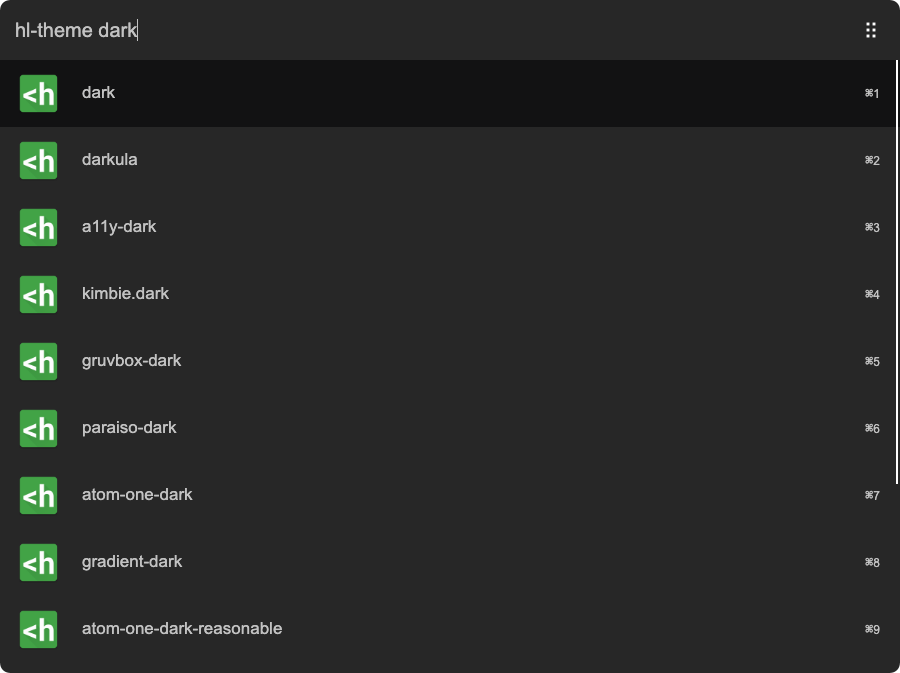
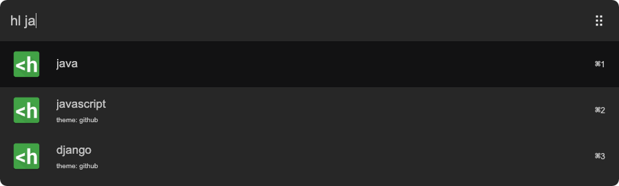

# arvis-hl

| plain text | colorized text |
|:----------:|:--------------:|
| ![][plain] | ![][colorized] |

> unicode support :tada:

## 🔗 This workflow is converted from [alfred-workflow](https://github.com/importre/alfred-hl).

* Note that there might be some code change or different actions from the original workflow.

* Marked original workflow's creator to author.


## Prerequisites

You need [Node.js 4+](https://nodejs.org).


## Usage

### Copy code snippet to clipboard

- <kbd>cmd</kbd> + <kbd>C</kbd>


### Set Theme (Optional)

> Default theme: `github`

- Type `hl-theme`, <kbd>Space</kbd>, find the theme you want
- Set the theme as default by pressing <kbd>Enter</kbd>



### Highlight code

- Type `hl`, <kbd>Space</kbd>, find the language you want
- <kbd>Enter</kbd>
    - <kbd>Enter</kbd> + <kbd>Cmd</kbd> if you want to prevent indentation
- <kbd>Cmd</kbd> + <kbd>V</kbd> to the rich text editor like [Pages](http://www.apple.com/mac/pages/), [Keynote](http://www.apple.com/kr/mac/keynote/)



## Install

```
$ npm i -g arvis-hl
```


## License

MIT © Jaewe Heo

[colorized]: https://cloud.githubusercontent.com/assets/1744446/16908802/3da56100-4d09-11e6-9a4a-ef73a06014bf.png
[plain]: https://cloud.githubusercontent.com/assets/1744446/16908803/3dae39e2-4d09-11e6-8d7e-f7cc25119fa7.png

